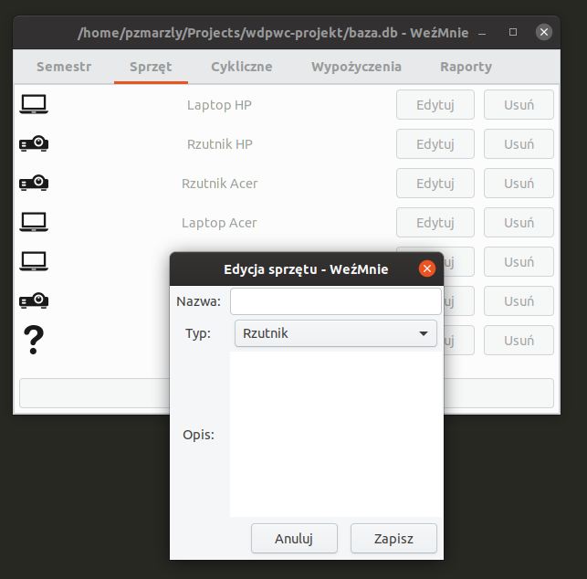

# Final assignment of a uni programming course

Docs \[PL\]: [docs/README.md](docs/README.md)

An equipment database and reservation system (including periodic reservations), written in C and
GTK. To run, use `make && ./wez-mnie-gtk`. Requirements: GTK+ 3.18 or above, GNU make, GNU gcc,
pkg-config. To build PDFs (via `make docs`), you will also need `pandoc`, `texlive-xelatex` and
`texlive-latex-recommended`.

Interesting files:

- [`Utils.c`](./Utils.c) - `file_exists`, `program_dir` (gets program location via
`/proc/self/exe`), `temp_file` (wrapper around `g_file_new_tmp`), `apply_css` (wrapper for
`GtkCssProvider`), `remove_all_gtk_children`
- [`RepoData.c`](./RepoData.c) - validation, formatting, wrappers around `GDateTime`
- [`RepoLogic.c`](./RepoLogic.c) - checking conflicts (functions are named in 1st conditional),
generating events from periodic event descriptions (imagine
[`spatie/opening-hours` library](https://github.com/spatie/opening-hours) but worse)
- [`Datepicker.c`](./Datepicker.c) - GTK datepicker in a pop-up window, builder pattern API (though
in the end the optional callback was never set anywhere in the project)

(c) 2019-2020 Paweł Zmarzły, licensed MIT.

## Icons

question-mark.png, image-projector.png, laptop.png: Icon made by Freepik from www.flaticon.com

whiteboard.png: Icons made by Kiranshastry from www.flaticon.com
